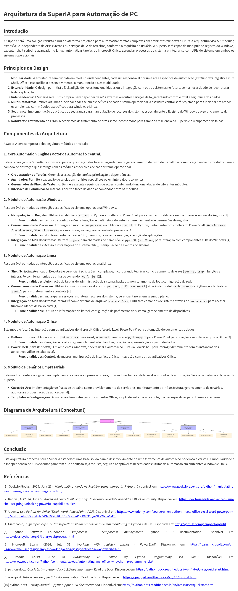

# Arquitetura da SuperIA para Automação de PC

## Introdução

A SuperIA será uma solução robusta e multiplataforma projetada para automatizar tarefas complexas em ambientes Windows e Linux. A arquitetura visa ser modular, extensível e independente de APIs externas ou serviços de IA de terceiros, conforme o requisito do usuário. A SuperIA será capaz de manipular o registro do Windows, executar shell scripting avançado no Linux, automatizar tarefas do Microsoft Office, gerenciar processos do sistema e integrar-se com APIs de sistema em ambos os sistemas operacionais.

## Princípios de Design

1.  **Modularidade:** A arquitetura será dividida em módulos independentes, cada um responsável por uma área específica de automação (ex: Windows Registry, Linux Shell, Office). Isso facilita o desenvolvimento, a manutenção e a escalabilidade.
2.  **Extensibilidade:** O design permitirá a fácil adição de novas funcionalidades ou a integração com outros sistemas no futuro, sem a necessidade de reestruturar toda a aplicação.
3.  **Independência:** A SuperIA será 100% própria, sem depender de APIs externas ou outros serviços de IA, garantindo controle total e segurança dos dados.
4.  **Multiplataforma:** Embora algumas funcionalidades sejam específicas de cada sistema operacional, a estrutura central será projetada para funcionar em ambos os ambientes, com módulos específicos para Windows e Linux.
5.  **Segurança:** Implementação de práticas de segurança para manipulação de recursos do sistema, especialmente o Registro do Windows e o gerenciamento de processos.
6.  **Robustez e Tratamento de Erros:** Mecanismos de tratamento de erros serão incorporados para garantir a resiliência da SuperIA e a recuperação de falhas.

## Componentes da Arquitetura

A SuperIA será composta pelos seguintes módulos principais:

### 1. Core Automation Engine (Motor de Automação Central)

Este é o coração da SuperIA, responsável pela orquestração das tarefas, agendamento, gerenciamento de fluxo de trabalho e comunicação entre os módulos. Será a camada de abstração que interage com os módulos específicos de cada sistema operacional.

-   **Orquestrador de Tarefas:** Gerencia a execução de tarefas, priorização e dependências.
-   **Agendador:** Permite a execução de tarefas em horários específicos ou em intervalos recorrentes.
-   **Gerenciador de Fluxo de Trabalho:** Define e executa sequências de ações, combinando funcionalidades de diferentes módulos.
-   **Interface de Comunicação Interna:** Facilita a troca de dados e comandos entre os módulos.

### 2. Módulo de Automação Windows

Responsável por todas as interações específicas do sistema operacional Windows.

-   **Manipulação do Registro:** Utilizará a biblioteca `winreg` do Python e cmdlets do PowerShell para criar, ler, modificar e excluir chaves e valores do Registro [1].
    -   **Funcionalidades:** Leitura de configurações, alteração de parâmetros do sistema, gerenciamento de permissões de registro.
-   **Gerenciamento de Processos:** Empregará o módulo `subprocess` e a biblioteca `psutil` do Python, juntamente com cmdlets do PowerShell (`Get-Process`, `Stop-Process`, `Start-Process`), para monitorar, iniciar, parar e controlar processos [4].
    -   **Funcionalidades:** Monitoramento de uso de CPU/memória, reinício de serviços, execução de aplicações.
-   **Integração de APIs do Sistema:** Utilizará `ctypes` para chamadas de baixo nível e `pywin32` (`win32com`) para interação com componentes COM do Windows [4].
    -   **Funcionalidades:** Acesso a informações do sistema (WMI), manipulação de eventos do sistema.

### 3. Módulo de Automação Linux

Responsável por todas as interações específicas do sistema operacional Linux.

-   **Shell Scripting Avançado:** Executará e gerenciará scripts Bash complexos, incorporando técnicas como tratamento de erros (`set -e`, `trap`), funções e integração com ferramentas de linha de comando (`curl`, `jq`) [2].
    -   **Funcionalidades:** Automação de tarefas de administração de sistema, backups, monitoramento de logs, configuração de rede.
-   **Gerenciamento de Processos:** Utilizará comandos nativos do Linux (`ps`, `top`, `kill`, `systemctl`) através do módulo `subprocess` do Python, e a biblioteca `psutil` para monitoramento e controle [4].
    -   **Funcionalidades:** Iniciar/parar serviços, monitorar recursos do sistema, gerenciar tarefas em segundo plano.
-   **Integração de APIs do Sistema:** Interagirá com o sistema de arquivos `/proc` e `/sys`, e utilizará comandos de sistema através do `subprocess` para acessar funcionalidades de baixo nível [4].
    -   **Funcionalidades:** Leitura de informações do kernel, configuração de parâmetros do sistema, gerenciamento de dispositivos.

### 4. Módulo de Automação Office

Este módulo focará na interação com os aplicativos do Microsoft Office (Word, Excel, PowerPoint) para automação de documentos e dados.

-   **Python:** Utilizará bibliotecas como `python-docx` para Word, `openpyxl` para Excel e `python-pptx` para PowerPoint para criar, ler e modificar arquivos Office [3].
    -   **Funcionalidades:** Geração de relatórios, preenchimento de planilhas, criação de apresentações a partir de dados.
-   **PowerShell (para Windows):** Em ambientes Windows, poderá usar a automação COM via PowerShell para interagir diretamente com as instâncias dos aplicativos Office instalados [3].
    -   **Funcionalidades:** Controle de macros, manipulação de interface gráfica, integração com outros aplicativos Office.

### 5. Módulo de Cenários Empresariais

Este módulo conterá a lógica para implementar cenários empresariais reais, utilizando as funcionalidades dos módulos de automação. Será a camada de aplicação da SuperIA.

-   **Casos de Uso:** Implementação de fluxos de trabalho como provisionamento de servidores, monitoramento de infraestrutura, gerenciamento de usuários, auditoria e orquestração de aplicações [4].
-   **Templates e Configurações:** Armazenará templates para documentos Office, scripts de automação e configurações específicas para diferentes cenários.

## Diagrama de Arquitetura (Conceitual)

## Conclusão

Esta arquitetura proposta para a SuperIA estabelece uma base sólida para o desenvolvimento de uma ferramenta de automação poderosa e versátil. A modularidade e a independência de APIs externas garantem que a solução seja robusta, segura e adaptável às necessidades futuras de automação em ambientes Windows e Linux.

## Referências

[1] GeeksforGeeks. (2025, July 23). *Manipulating Windows Registry using winreg in Python*. Disponível em: [https://www.geeksforgeeks.org/python/manipulating-windows-registry-using-winreg-in-python/](https://www.geeksforgeeks.org/python/manipulating-windows-registry-using-winreg-in-python/)

[2] Kediyal, A. (2024, June 5). *Advanced Linux Shell Scripting: Unlocking Powerful Capabilities*. DEV Community. Disponível em: [https://dev.to/iaadidev/advanced-linux-shell-scripting-unlocking-powerful-capabilities-4ien](https://dev.to/iaadidev/advanced-linux-shell-scripting-unlocking-powerful-capabilities-4ien)

[3] Udemy. *Use Python for Office (Excel, Word, PowerPoint, PDF)*. Disponível em: [https://www.udemy.com/course/when-python-meets-office-excel-word-powerpoint-pdf/?srsltid=AfmBOooMwNZiPJxF9D9uRf_ECslGvrHwPgoP8F31tyeiQLX2letw6M7o](https://www.udemy.com/course/when-python-meets-office-excel-word-powerpoint-pdf/?srsltid=AfmBOooMwNZiPJxF9D9uRf_ECslGvrHwPgoP8F31tyeiQLX2letw6M7o)

[4] Giampaolo, R. *giampaolo/psutil: Cross-platform lib for process and system monitoring in Python*. GitHub. Disponível em: [https://github.com/giampaolo/psutil](https://github.com/giampaolo/psutil)

[5] Python Software Foundation. *subprocess — Subprocess management*. Python 3.13.7 documentation. Disponível em: [https://docs.python.org/3/library/subprocess.html](https://docs.python.org/3/library/subprocess.html)

[6] Microsoft Learn. (2024, July 31). *Working with registry entries - PowerShell*. Disponível em: [https://learn.microsoft.com/en-us/powershell/scripting/samples/working-with-registry-entries?view=powershell-7.5](https://learn.microsoft.com/en-us/powershell/scripting/samples/working-with-registry-entries?view=powershell-7.5)

[7] Reddit. (2019, June 5). *Automating MS Office w/ Python Programming via Win32*. Disponível em: [https://www.reddit.com/r/Python/comments/bxx0ua/automating_ms_office_w_python_programming_via/](https://www.reddit.com/r/Python/comments/bxx0ua/automating_ms_office_w_python_programming_via/)

[8] python-docx. *Quickstart — python-docx 1.2.0 documentation*. Read the Docs. Disponível em: [https://python-docx.readthedocs.io/en/latest/user/quickstart.html](https://python-docx.readthedocs.io/en/latest/user/quickstart.html)

[9] openpyxl. *Tutorial — openpyxl 3.1.4 documentation*. Read the Docs. Disponível em: [https://openpyxl.readthedocs.io/en/3.1/tutorial.html](https://openpyxl.readthedocs.io/en/3.1/tutorial.html)

[10] python-pptx. *Getting Started — python-pptx 1.0.0 documentation*. Disponível em: [https://python-pptx.readthedocs.io/en/latest/user/quickstart.html](https://python-pptx.readthedocs.io/en/latest/user/quickstart.html)

